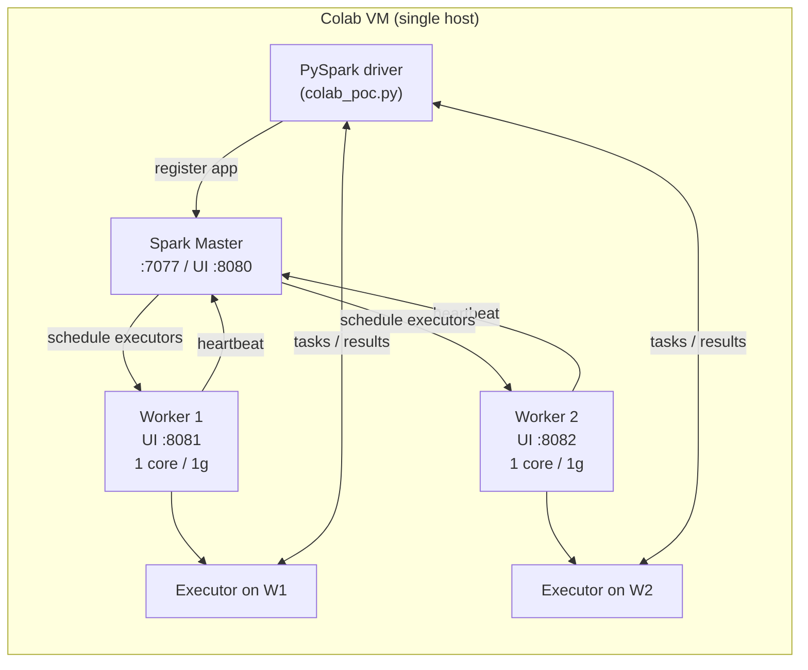
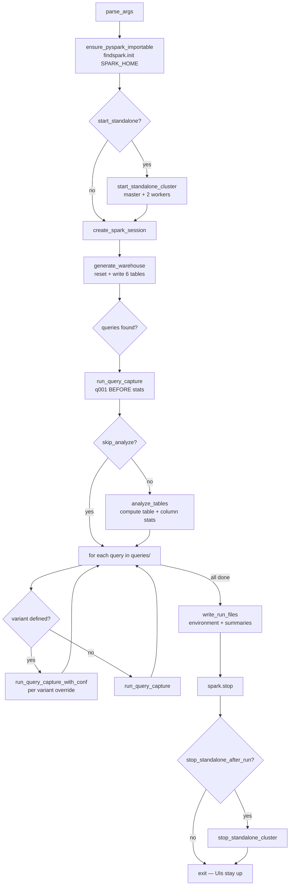
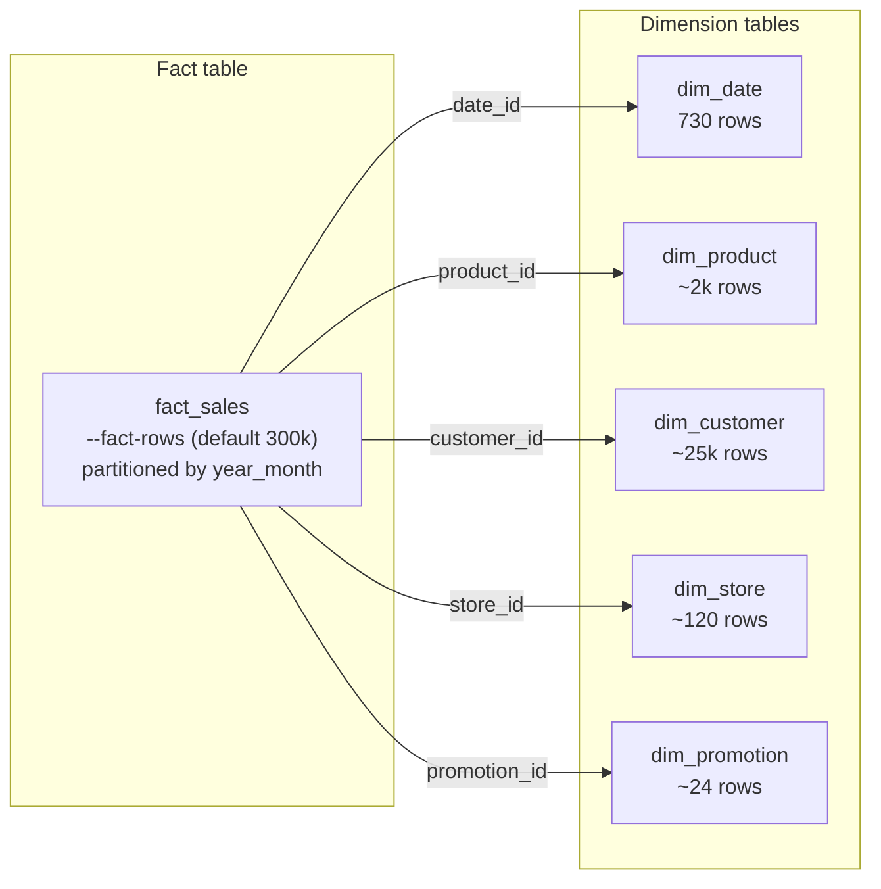
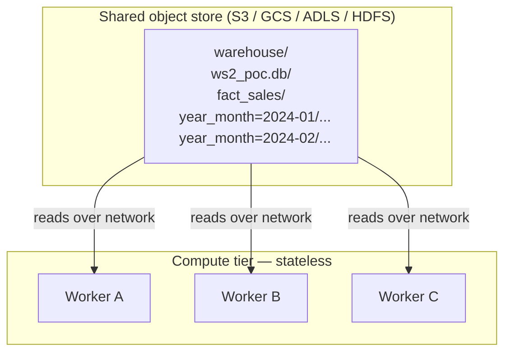
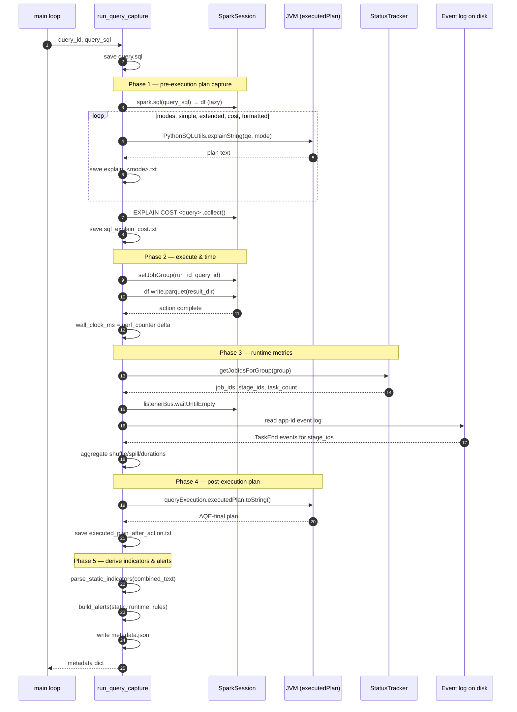
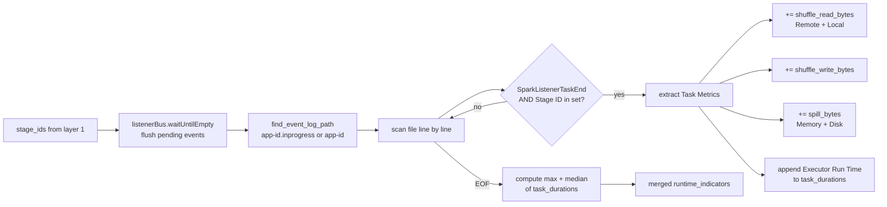
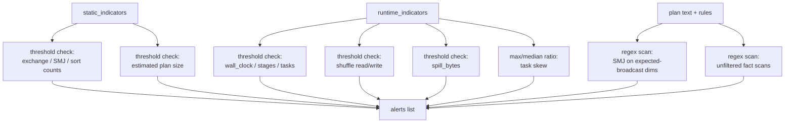
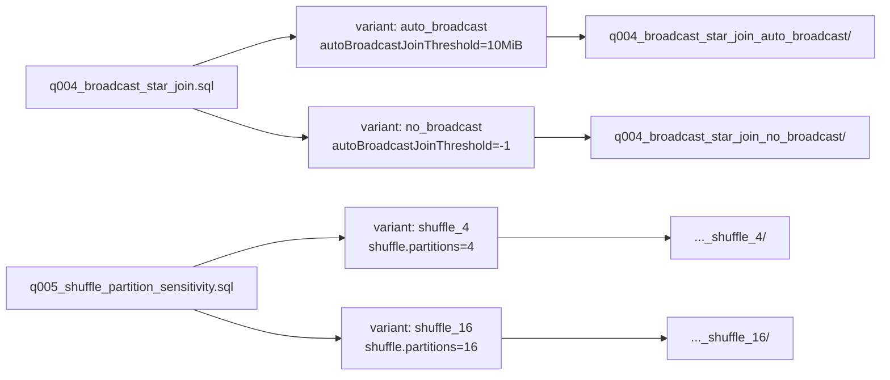

# Workstream 2 POC — Architecture & Logic Walkthrough

This document explains how `colab_poc.py` works, end to end. The README is the user-facing quick-start; this file is for anyone modifying the script or studying the plan-capture pattern.

All diagrams use [Mermaid](https://mermaid.js.org/). GitHub renders them natively.

## Contents

1. [Purpose & Design Intent](#1-purpose--design-intent)
2. [Process Topology](#2-process-topology)
3. [Execution Lifecycle](#3-execution-lifecycle)
4. [Warehouse Generation](#4-warehouse-generation)
    - [4a. Where the warehouse physically lives — POC vs real clusters](#4a-where-the-warehouse-physically-lives--poc-vs-real-clusters)
    - [4b. Table statistics — when, where, and why the metastore owns them](#4b-table-statistics--when-where-and-why-the-metastore-owns-them)
5. [Per-Query Capture Sequence](#5-per-query-capture-sequence)
6. [Runtime Metrics — StatusTracker + Event Log](#6-runtime-metrics--statustracker--event-log)
7. [Static Plan Indicators](#7-static-plan-indicators)
8. [Alert Evaluation](#8-alert-evaluation)
9. [Configuration Variants](#9-configuration-variants)
10. [Output Artifacts — What Lands Where](#10-output-artifacts--what-lands-where)
11. [Function Reference (by topic)](#11-function-reference-by-topic)
12. [Things That Look Weird But Aren't](#12-things-that-look-weird-but-arent)
13. [Extending the POC](#13-extending-the-poc)

---

## 1. Purpose & Design Intent

The POC has three goals:

1. **Stand up a realistic-shaped Spark cluster** inside Colab's single VM — one master, two workers, one driver — so plans go through the same code paths as a multi-host cluster (broadcast exchanges, shuffles, AQE) rather than `local[*]`.
2. **Run a fixed query suite over a synthetic star schema**, capturing every flavor of Spark `EXPLAIN` output plus a post-execution physical plan, for each query.
3. **Reduce each captured plan to a small, structured indicator set** (exchange counts, broadcast/SMJ counts, estimated sizes) and pair it with runtime metrics from the Spark event log, so that downstream analysis (or an LLM) can reason over plans without re-parsing raw text.

The script intentionally keeps the workload in SQL strings (`queries/*.sql`) and uses PySpark only as a thin wrapper for setup, capture, and metadata.

---

## 2. Process Topology

When `--start-standalone` is set, the script runs four cooperating processes inside Colab's VM:



The master and workers are launched as detached subprocesses (`start_new_session=True`) with their PIDs written to `<base-dir>/standalone-pids/` so they can be stopped later. See `start_standalone_cluster` (`colab_poc.py:90`) and `stop_standalone_cluster` (`colab_poc.py:153`).

Why two workers instead of `local[*]`? It forces Spark to use real shuffle/broadcast code paths, gives you per-worker UIs to inspect, and keeps task counts comparable to a small distributed cluster.

---

## 3. Execution Lifecycle

This is what happens from the moment `python colab_poc.py …` starts until the script exits.



Key design choices visible in this flow:

- **Q001 runs twice** — once before `ANALYZE TABLE … COMPUTE STATISTICS` and once after. This produces a paired before/after artifact pair so you can see how CBO and broadcast decisions change when stats become available. Look in `main` (`colab_poc.py:1033`).
- **Variants are first-class.** `QUERY_CONF_VARIANTS` (`colab_poc.py:32`) maps a base query ID to a list of `(name, conf_overrides)` tuples. Q004 runs with auto-broadcast ON vs OFF, Q005 runs with `shuffle.partitions=4` vs `=16`. Each variant gets its own output directory.
- **`spark.stop()` is unconditional**, but the standalone cluster is left alive by default so the UIs at `:8080` / `:8081` / `:8082` remain browsable.

---

## 4. Warehouse Generation

`generate_warehouse` (`colab_poc.py:377`) builds a synthetic retail star schema. The trick is that every column is a deterministic function of `id` (plus a seeded `F.rand`), so the data is reproducible across runs.



Things worth knowing:

- **Built-in skew.** `generate_fact_sales` (`colab_poc.py:318`) makes ~38% of rows point to `product_id=1` and ~62% to `promotion_id=0`. This is what powers Q006 (skewed product hotspots) and gives AQE skew-join something real to react to.
- **Partitioning.** Only `fact_sales` is partitioned (`year_month`). Dimensions are written as flat parquet directories. This is what makes the unfiltered-fact-scan alert meaningful — if a query reads `fact_sales` without a partition filter, you see it in `PartitionFilters: []`.
- **Tables are external.** `create_external_table` (`colab_poc.py:373`) registers each parquet directory as a Hive-style external table in database `ws2_poc`. This is what lets the workload be pure SQL while the data lives in plain parquet on disk.
- **Idempotency.** `reset_database` (`colab_poc.py:198`) drops tables and `rmtree`s `<base-dir>/data/` before regenerating. Every run starts clean.

### 4a. Where the warehouse physically lives — POC vs real clusters

Before going further, it's worth being explicit about where the directories produced above actually live, both in this POC and in a production setting. The shape looks identical inside Colab because everything shares one filesystem; a real cluster splits them apart.

Two distinct directories under `<base-dir>` play different roles:

| Directory | What it holds | Size |
|---|---|---|
| `warehouse/` | The Spark **metastore** (Derby DB). Just metadata — table names, schemas, locations, column stats. | Tiny |
| `data/` | The actual parquet files. The metastore points at these via `CREATE TABLE … LOCATION '<path>'`. | Whatever `--fact-rows` produces |

Because Colab is one VM, the driver and both workers all read from the same local filesystem. There's no copying — every executor opens the parquet files directly.

**A real-world cluster does not shard the warehouse onto workers' local disks.** Storage and compute are separated. Data lives in a shared object store (S3, GCS, ADLS) or distributed FS (HDFS); workers are stateless compute that read from that store on demand:



What actually happens at query time:

1. **Driver consults the metastore** (Hive Metastore, Glue, Unity Catalog) to resolve `ws2_poc.fact_sales` to a path and partition list.
2. **Driver lists files** under the table path, applying partition pruning if filters allow.
3. **Driver assigns file splits to tasks**, schedules tasks on workers.
4. **Each task reads its split directly from the object store** — over the network. Nothing is pre-copied.
5. **Shuffle data is written to local disk** on each worker during execution (the only time workers hold meaningful data) and read back by downstream tasks. Wiped when the app ends.

So: **partitioning is logical** (folders in the storage layout, e.g. `year_month=…`), **not physical-per-worker**. The same file can be read by any worker.

#### A clearer mental model

A useful one-liner: *the metastore is an index of table URIs in shared storage; the driver expands each URI into file splits at query time and dispatches them to stateless workers, which read directly from storage and compute.*

Two terms that often cause confusion:

- **"Bucket" is overloaded.** An **S3 bucket** is a top-level object-storage namespace (e.g. `s3://my-company-lake/`). A **Spark/Hive bucket** is a hash-partitioning scheme *inside* a table (`CLUSTERED BY (customer_id) INTO 32 BUCKETS`) — a logical layout concept, unrelated to physical storage. What the metastore actually stores per table is a **URI** plus its partition spec; one table can span many files, and many tables can share a single S3 bucket. The "index" relationship is **metastore → URI → file list**.

- **The "routing" between workers and storage is per-query and ephemeral**, not a persistent map. There is no standing "worker A owns these files" assignment:

  ```
  driver:
    metastore lookup → resolve table to URI
    list files under URI (with partition pruning)
    split files into ~128 MB chunks → list of input splits
    build task DAG, one task per split
    schedule tasks onto available executors

  executor:
    receives task with "read this file, this byte range"
    opens URI directly, reads parquet, processes
  ```

  The driver freshly computes splits and dispatches tasks every query. If a worker dies mid-query, the driver re-dispatches its tasks to surviving workers — they pull the same files from storage. That's what makes the compute tier stateless and elastic.

#### Historical exception — HDFS data locality

The original Hadoop model *did* put data physically on workers (DataNodes), and Spark would prefer to schedule tasks where blocks already lived — the `PROCESS_LOCAL → NODE_LOCAL → RACK_LOCAL → ANY` preference order. Cloud object stores broke that model: everything is "ANY" because everything is over the network. Modern Spark deployments mostly don't care about locality anymore.

#### Where copying *does* happen

A few real cases where data is genuinely pushed to workers:

| Mechanism | When | What gets copied |
|---|---|---|
| **Broadcast variables / broadcast joins** | Small side of a join | Driver sends the whole table to every executor (RAM). This is exactly what the Q004 `auto_broadcast` variant exercises. |
| **Caching (`df.cache()`)** | Explicit user request | Partitions materialized into executor memory / local disk. |
| **Disk cache** (e.g. Databricks Photon) | Automatic | Parquet files cached on worker SSDs to avoid re-reading from object store. |
| **Shuffle** | Wide transformations | Map-stage output written to local disk, reduce-stage tasks fetch it remotely. |

#### Mapping back to the POC

`<base-dir>/data/` plays the role of the "shared object store" — it's a single location all participants can read. If you were to deploy this same pattern in production, you'd change exactly one thing: `--base-dir s3://my-bucket/spark_sql_plan_poc` (with the appropriate Hadoop S3 configuration), and the rest of the script would work unchanged because Spark abstracts the filesystem behind `URI`s.

### 4b. Table statistics — when, where, and why the metastore owns them

The `warehouse/` directory holds more than just table schemas — it's also the home for the **table statistics** that the cost-based optimizer (CBO) reads when planning a query. The Q001 before/after-stats pair captured by this POC is meant to make this concrete: the same SQL is planned twice, and the only thing that changes between runs is what's stored in the warehouse metadata.

#### When `ANALYZE TABLE` typically runs

Four common patterns, from most to least manual:

| Pattern | When | Who triggers it |
|---|---|---|
| **Manual / ad-hoc** | After a noticeably-skewed plan or while debugging | Data engineer or DBA, by hand |
| **Post-ETL hook** | Right after a batch load finishes | The ETL framework (Airflow, dbt, Dagster) tacks `ANALYZE TABLE …` onto the job graph |
| **Scheduled refresh** | Nightly or weekly, often only for large or hot tables | Cron / Airflow; usually with `NOSCAN` for cheap size-only updates |
| **Automatic / continuous** | As data is written | Built into the table format itself (Delta, Iceberg, Snowflake, BigQuery) |

A practical rule: **stats go stale when data distribution shifts, not when time passes.** Time-based scheduling is a heuristic, not a rule.

#### Where stats are stored

Always alongside the table metadata, in whatever catalog the table lives in. There's no separate "stats database" in mainstream systems:

| Catalog / format | Where stats land |
|---|---|
| **Hive Metastore** (this POC) | `TBLPROPERTIES` on the table (`numRows`, `totalSize`, `rawDataSize`); column stats in a `COLUMN_STATISTICS` table; per-partition stats on partition rows |
| **AWS Glue Data Catalog** | `Parameters` dict on the `Table` and `Partition` API objects (same shape as Hive) |
| **Unity Catalog** (Databricks) | Managed table metadata; surfaced via `DESCRIBE EXTENDED` and `system.information_schema` |
| **Delta Lake** | `_delta_log/*.json` records min/max/null counts per file in `add` actions; table-level stats in commit metadata |
| **Apache Iceberg** | Manifest files carry per-file column stats; table-level summaries in `metadata.json` |
| **Apache Hudi** | `.hoodie/metadata/` index tracks file-level column stats |

In Spark, `ANALYZE TABLE ws2_poc.fact_sales COMPUTE STATISTICS` writes back to the metastore — in this POC, the Derby database under `<base-dir>/warehouse/metastore_db/`. You can see the result with `DESCRIBE EXTENDED ws2_poc.fact_sales`.

#### Why the warehouse metadata is the right home

- **Atomic with schema.** Drop a table → its stats go with it. No orphaned stats.
- **Single lookup.** The planner already calls the catalog to resolve table → URI; stats come back in the same trip.
- **Authoritative across engines.** Spark, Trino, Presto, Athena, Hive — anyone hitting the same catalog sees the same stats. No "which cache is current" question.
- **Versioned with the table** in modern formats. Delta and Iceberg embed stats inside the commit, so stats are consistent with the data at that snapshot.

#### Why an external Redis-with-TTL cache is the wrong fit for stats

Tempting idea, but it fails on two axes:

**1. TTL is the wrong invalidation signal.** Stats don't expire on a clock — they expire when **data changes**. A wall-clock TTL has two failure modes simultaneously:

| Scenario | TTL behavior | What you actually want |
|---|---|---|
| Stats are 6 days old, no writes since | Marked stale at 7-day TTL, recomputed, identical result — wasted compute | Skip — stats are still correct |
| 2M rows just landed, stats are 1 hour old | Marked fresh — planner uses outdated stats | Invalidate immediately |

The correct invalidation trigger is a **write event**. Delta and Iceberg get this for free because the commit log is the trigger. With a Redis cache, you'd need every writer to invalidate the right key — at which point the catalog is still the source of truth and Redis is just a downstream read-through cache, not the home.

**2. The lookup path argues against it.** Spark's planner pulls stats via `SessionCatalog → ExternalCatalog → metastore client`. The metastore is already fast (single-digit ms reads) and the metastore client has its own in-process cache. Bolting Redis between Spark and the metastore is usually a solution in search of a problem.

#### Where Redis-like caches *do* fit in the planning pipeline

These are real production patterns — note that none of them replace the catalog as the source of truth for stats:

| Use case | Why a cache fits | Notes |
|---|---|---|
| **File listing cache** | `LIST` against S3/GCS is slow and expensive; the same prefix is listed many times per session | Databricks calls this "metadata cache"; it's internal to the engine |
| **Plan cache** | Identical SQL re-submitted often (dashboards, BI tools) — skip re-planning | Trino keeps this in-memory; some teams externalize for multi-tenant gateways |
| **Result cache** | Same query, same data → return cached result | Snowflake's result cache is this |
| **Catalog-API cache** | TTL'd read-through cache of metastore responses | Built into most engines (`hive.metastore-cache-ttl` in Trino) |
| **Streaming-driven stats sidecar** | Approximate real-time counts (HyperLogLog) updated as events stream in | Used for routing decisions, not full CBO |

So the right framing is: **cache derived artifacts, not authoritative stats.** The metastore stays the home for stats; caches sit downstream of it (or inside the engine), holding things like file listings, plan trees, and result rows.

#### Tying back to this POC

The "after stats" run captured under `artifacts/runs/.../q001_monthly_category_revenue/` shows `fact_sales` with `rowCount=0` — not because stats failed to write, but because `ANALYZE TABLE … COMPUTE STATISTICS` on a Hive-style external partitioned table doesn't enumerate partitions by default. The fix is one of:

- Run `ANALYZE TABLE ws2_poc.fact_sales PARTITION (year_month=…) COMPUTE STATISTICS` per partition.
- Use `MSCK REPAIR TABLE` first to register partitions (Spark SQL supports this command), then `ANALYZE TABLE … COMPUTE STATISTICS FOR ALL COLUMNS NOSCAN`.
- Migrate `fact_sales` to Delta or Iceberg so per-file stats are maintained on write — no separate analyze step needed.

This is a good example of why the before/after-stats capture pair is in the run: degenerate stats can mislead the planner *more* than no stats at all (the after-stats plan flipped every join's build side based on a `rowCount=0` it should not have trusted).

---

## 5. Per-Query Capture Sequence

This is the core of the POC. For each query, `run_query_capture` (`colab_poc.py:811`) does the following:



A few subtleties:

- **Five flavors of plan are captured.** `simple`, `extended`, `cost`, `formatted` (via `df.explain`) plus `EXPLAIN COST` issued as SQL plus the executed plan post-action. They differ in what they include (logical vs physical, with/without stats, with/without AQE rewrites). The `cost` and `executed_plan` are the most useful for analysis; the others are kept for reference.
- **The action is `df.write.parquet`, not `.collect()`.** Writing forces a full materialization across executors, which produces realistic shuffle stages and stage IDs that the status tracker can return. `.collect()` would funnel everything back through the driver.
- **`setJobGroup` is the key handle.** Spark doesn't directly expose "which jobs belong to this query." The job group is a local property that propagates to every job submitted between `setJobGroup` and `clearJobGroup`. After the action, `getJobIdsForGroup` returns exactly those jobs.
- **`clearJobGroup` goes through `_jsc`** (`colab_poc.py:844`) because PySpark's `SparkContext` doesn't expose the method directly — only the underlying `JavaSparkContext` does.

---

## 6. Runtime Metrics — StatusTracker + Event Log

There are two layers of runtime metrics, captured by two different functions:

### Layer 1 — `status_tracker_metrics` (`colab_poc.py:519`)

In-memory, fast, but coarse:

| Metric | Source |
|---|---|
| `wall_clock_ms` | `perf_counter` around the action |
| `job_count` | `tracker.getJobIdsForGroup(group)` |
| `stage_count` | union of `JobInfo.stageIds` |
| `task_count` | sum of `StageInfo.numTasks` |
| `job_ids` / `stage_ids` | for downstream filtering |

Shuffle bytes, spill, and per-task durations are **not** in the in-memory tracker — they live in stage-level executor metrics that PySpark doesn't surface cleanly.

### Layer 2 — `enrich_runtime_metrics_from_event_log` (`colab_poc.py:560`)

For the granular metrics, the script re-reads Spark's own event log:



Important caveats (also noted in the README):

- **The event log is the source of truth, but it's eventually consistent.** `waitUntilEmpty(10000)` gives the listener bus 10 seconds to flush; for very short stages, the tail TaskEnd events may still be missing when the file is read.
- **The file path varies.** While the app is running, it's `<event-log-dir>/<app-id>.inprogress`. After `spark.stop()`, it's renamed to `<event-log-dir>/<app-id>`. `find_event_log_path` (`colab_poc.py:552`) checks both.
- **Stage IDs are filtered.** Only TaskEnd events whose `Stage ID` is in the per-query set are counted. This is how the script avoids attributing earlier warehouse-build tasks to the wrong query.

---

## 7. Static Plan Indicators

`parse_static_indicators` (`colab_poc.py:491`) reduces the concatenated plan text into a small dict:

| Indicator | Regex it counts |
|---|---|
| `exchange_count` | `\bExchange\b` |
| `broadcast_exchange_count` | `\bBroadcastExchange\b` |
| `broadcast_join_count` | `\bBroadcastHashJoin\b` |
| `sort_merge_join_count` | `\bSortMergeJoin\b` |
| `hash_aggregate_count` | `\bHashAggregate\b` |
| `window_count` | `\bWindow\b` |
| `sort_count` | `\bSort\b` |
| `scan_count` | `\bScan\b` |
| `estimated_size_in_bytes_max` | max of `sizeInBytes=...` |
| `estimated_row_count_max` | max of `rowCount=...` |

This is deliberately dumb — it's regex over the explain text, not AST inspection. The point is to give downstream analysis (humans, dashboards, an LLM) a stable, low-cardinality summary it can compare across queries and variants without re-parsing Spark's plan syntax.

The `\b` word boundaries are load-bearing: `\bSort\b` does **not** match `SortMergeJoin` (no boundary between `Sort` and `M`), so the SMJ and Sort counters don't double-count. Same logic protects `\bExchange\b` from matching `BroadcastExchange` and `\bScan\b` from being inflated by `FileScan`-style compound tokens.

The `combined_plan_text` (`colab_poc.py:853`) is the concatenation of all four `explain_*` modes plus `executed_plan_after_action`. Counts therefore include both physical-plan operators and any AQE-substituted nodes that only appear post-action.

---

## 8. Alert Evaluation

`build_alerts` (`colab_poc.py:662`) compares the static + runtime indicators against thresholds in `config/alert_rules.json`:



Two of these are not simple threshold checks:

- **`detect_smj_on_expected_dimensions`** (`colab_poc.py:629`) — walks each `SortMergeJoin` occurrence in the plan and looks ~1500 chars downstream for any of the dimension table names listed in `expected_broadcast_dimensions`. If you'd expected a dimension to broadcast (because it's small and you have stats) but the plan shows SMJ-against it, you get an alert.
- **`detect_unfiltered_fact_scans`** (`colab_poc.py:641`) — walks each `Scan parquet <fact_table>` occurrence, finds the following `PartitionFilters: [...]` and `PushedFilters: [...]` lines, and alerts when both are empty. This catches queries that read the entire fact table when a partition pushdown was expected.

These two checks are the most "intelligent" part of the script — everything else is counters and thresholds.

---

## 9. Configuration Variants

For Q004 and Q005, the same SQL is run multiple times with different Spark confs, so you can A/B the plan-shape impact:



`run_query_capture_with_conf` (`colab_poc.py:882`) saves and restores the previous values of any conf it overrides, so variants don't leak into the next query. The override map is added to that variant's `metadata.json` so the artifact records what was changed.

---

## 10. Output Artifacts — What Lands Where

Each successful run produces this tree under `<base-dir>`:

```
<base-dir>/
├── data/                              # parquet, regenerated each run
│   ├── dim_*/
│   └── fact_sales/year_month=.../
├── spark-events/                      # raw event log (re-read for runtime metrics)
├── warehouse/                         # Spark metastore (Derby) for the ws2_poc DB
├── worker-1/  worker-2/               # executor working directories
├── standalone-logs/                   # master + worker stdout/stderr
├── standalone-pids/                   # PID files used by stop_standalone_cluster
└── artifacts/
    └── runs/
        └── <run-id>/
            ├── environment.json       # spark version, conf snapshot, python version
            ├── data_profile.json      # table paths, requested vs actual row counts
            ├── run_summary.csv        # one row per query, scannable metrics
            ├── run_summary.json       # full per-query metadata array
            └── <query_id>/
                ├── query.sql
                ├── explain_simple.txt
                ├── explain_extended.txt
                ├── explain_cost.txt
                ├── explain_formatted.txt
                ├── sql_explain_cost.txt
                ├── executed_plan_after_action.txt
                ├── metadata.json      # static + runtime indicators + alerts
                └── result_parquet/    # query output (mainly to force materialization)
```

Two artifacts deserve callouts:

- **`metadata.json`** is the structured digest — everything downstream analysis cares about lives here.
- **`executed_plan_after_action.txt`** captures the *AQE-final* plan. Compare it against `explain_formatted.txt` to see what AQE actually changed at runtime (coalesce, skew-split, dynamic switch from SMJ to broadcast).

---

## 11. Function Reference (by topic)

| Topic | Functions | Lines |
|---|---|---|
| Bootstrap | `ensure_pyspark_importable`, `parse_args`, `main` | 62, 975, 1012 |
| Standalone lifecycle | `start_background_process`, `start_standalone_cluster`, `stop_standalone_cluster` | 73, 90, 153 |
| Spark session | `create_spark_session`, `selected_spark_conf` | 169, 782 |
| Warehouse | `reset_database`, `generate_dim_*`, `generate_fact_sales`, `write_table`, `create_external_table`, `generate_warehouse`, `analyze_tables` | 198–432 |
| Query loading | `load_queries`, `table_names_from_sql` | 434, 806 |
| Plan capture | `explain_dataframe`, `sql_explain_cost`, `run_query_capture`, `run_query_capture_with_conf` | 443, 453, 811, 882 |
| Indicator parsing | `parse_size_to_bytes`, `parse_static_indicators` | 465, 491 |
| Runtime metrics | `status_tracker_metrics`, `find_event_log_path`, `enrich_runtime_metrics_from_event_log` | 519, 552, 560 |
| Alerts | `detect_smj_on_expected_dimensions`, `detect_unfiltered_fact_scans`, `load_alert_rules`, `build_alerts` | 629, 641, 658, 662 |
| Run-level outputs | `save_text`, `write_run_files` | 461, 913 |

---

## 12. Things That Look Weird But Aren't

- **`df._sc._jvm.PythonSQLUtils.explainString(...)`** in `explain_dataframe` (`colab_poc.py:445`) — this is the only way to get all four explain modes as strings without printing to stdout. The fallback uses `redirect_stdout` to capture `df.explain()` output if the JVM method isn't available.
- **`spark.sparkContext._jsc.clearJobGroup()`** (`colab_poc.py:844`) — PySpark exposes `setJobGroup` but not `clearJobGroup`; only the underlying `JavaSparkContext` has it.
- **`df._jdf.queryExecution().executedPlan().toString()`** (`colab_poc.py:848`) — public PySpark has no method that returns the post-AQE plan after an action. Going through `_jdf` is the standard escape hatch and is wrapped in try/except so a future API change doesn't break the run.
- **`spark.sql.debug.maxToStringFields=200`** (`colab_poc.py:190`) — raised from the default 25 so plan nodes with many fields (grouping sets, wide aggregations) don't get truncated in the saved text artifacts.

---

## 13. Extending the POC

Common modifications and where to make them:

- **Add a query.** Drop a `qNNN_*.sql` file into `queries/`. It runs automatically. To exercise conf variants, add an entry to `QUERY_CONF_VARIANTS`.
- **Add an indicator.** Extend `parse_static_indicators` (`colab_poc.py:491`) and optionally add a threshold in `config/alert_rules.json` plus a check in `build_alerts`.
- **Add a runtime metric.** Inside `enrich_runtime_metrics_from_event_log` (`colab_poc.py:560`), pull more fields out of `Task Metrics` — Spark's event log carries a lot more than what's currently aggregated.
- **Change cluster shape.** Edit `start_standalone_cluster` (`colab_poc.py:90`) — more workers, more cores per worker, different memory. Be aware of Colab's resource ceiling.
- **Run without standalone.** Drop `--start-standalone` and pass `--master "local[*]"` (or any external master URL). Useful for fast local iteration.
